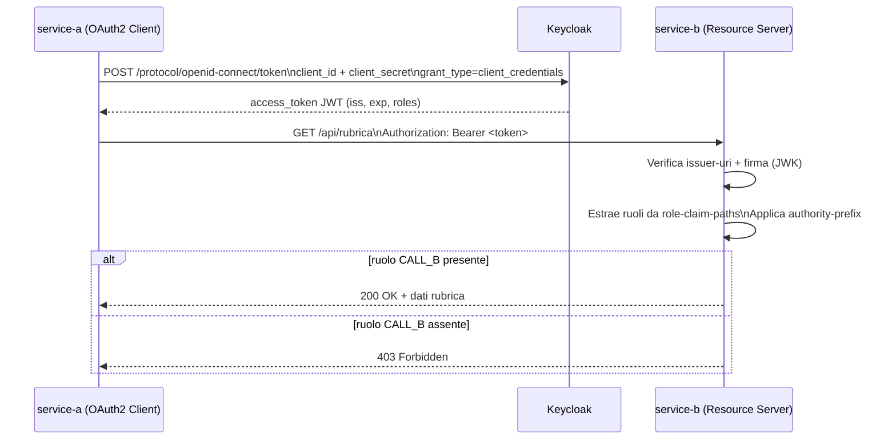

# Demo M2M con Keycloak, Service A e Service B

Questo progetto mostra una comunicazione **machine-to-machine** tra due microservizi Spring Boot usando **Keycloak** come Identity Provider.

## Obiettivo

- `service-a` ottiene un token da Keycloak con `client_id` + `client_secret` (grant `client_credentials`)
- `service-a` chiama `service-b` passando il bearer token
- `service-b` valida il JWT e autorizza solo chi ha il ruolo `CALL_B`

## Componenti

- `docker-compose.yml`: avvio Keycloak + APISIX gateway
- `apisix/conf/apisix.yaml`: route APISIX protetta con OpenID Connect verso Keycloak
- `keycloak/realm-rubrica.json`: realm, client e ruoli
- `service-a`: client OAuth2 che inoltra la chiamata verso `service-b`
- `service-b`: resource server JWT, endpoint protetto con ruolo

## APISIX: come funziona e come si usa

APISIX è il gateway davanti a `service-open`:

- ingresso client: `http://localhost:9080/hello-myworld`
- controllo token OAuth2/OIDC contro Keycloak
- inoltro all'upstream `service-open` su `host.docker.internal:8082`

Configurazione chiave:

- route e plugin OIDC: `apisix/conf/apisix.yaml`
- porta pubblica APISIX: `9080` in `docker-compose.yml`
- upstream backend: `host.docker.internal:8082` in `apisix/conf/apisix.yaml`

Uso rapido:

1. Avvia `service-open` (deve ascoltare su `8082`)
2. Avvia infrastruttura gateway+IdP:
   - `./start-docker-compose.sh`
3. Test senza token (atteso `401`):
   - `curl -i http://localhost:9080/hello-myworld`
4. Test con token OAuth2 (atteso `200`):
   - `./test_apisix_oauth2.sh`

Come cambiare backend/porta:

- se `service-open` cambia porta, aggiorna:
  - `server.port` in `service-open/src/main/resources/application.properties`
  - nodo upstream in `apisix/conf/apisix.yaml`
- poi ricarica APISIX:
  - `docker compose restart apisix`

## OpenResty: esempio equivalente ad APISIX

È disponibile anche una variante gateway con OpenResty davanti a `service-open`:

- ingresso client: `http://localhost:9081/hello-myworld`
- validazione bearer token OIDC/JWT contro Keycloak via `lua-resty-openidc`
- controllo ruolo realm (`CALL_B`) via Lua (`openresty/lua/role_guard.lua`)
- inoltro all'upstream `service-open` su `host.docker.internal:8082`

File principali:

- servizio nel compose principale (`profile: openresty`): `docker-compose.yml`
- immagine e moduli Lua: `openresty/Dockerfile`
- config gateway: `openresty/nginx.conf`
- guard ruoli: `openresty/lua/role_guard.lua`

Uso rapido:

1. Avvia `service-open` (porta `8082`)
2. Avvia stack OpenResty + Keycloak:
   - `./start-openresty-compose.sh`
3. Test senza token (atteso `401`):
   - `curl -i http://localhost:9081/hello-myworld`
4. Test con token client role (atteso `200`):
   - `./test_openresty_oauth2.sh`
5. Test con token client senza ruolo (atteso `403`):
   - `./test_openresty_oauth2_no_role.sh`

Stop stack OpenResty:

- `./stop-openresty-compose.sh`

## Flusso autorizzativo

1. Client M2M (service-a-role) richiede token a Keycloak
2. Keycloak emette access token JWT
3. `service-a` usa il token per chiamare `service-b`
4. `service-b` verifica issuer/firma/token e ruoli
5. Se presente `CALL_B` -> `200` con dati rubrica, altrimenti `403`

## Porte

- Keycloak: `8190`
- Service B: `8082`
- Service A role: `8081`
- Service A no-role (profilo `no-role`): `8083`

## Client Keycloak usati

- `service-a-client` / `service-a-secret` -> con ruolo `CALL_B`
- `service-a-no-role-client` / `service-a-no-role-secret` -> senza ruolo

## Convenzioni configurazione sicurezza

Per ridurre accoppiamento con un IdP specifico, la configurazione applicativa usa prefissi generici.

- `service-a`:
   - `app.security.oauth2.client-registration-id`
   - `app.security.oauth2.principal`
   - registrazione OAuth2 sotto `spring.security.oauth2.client.registration.m2m.*`
   - provider token sotto `spring.security.oauth2.client.provider.m2m.*`

- `service-b`:
   - `app.security.idp.issuer-uri`
   - `app.security.idp.role-claim-paths`
   - `app.security.idp.authority-prefix`
   - `spring.security.oauth2.resourceserver.jwt.issuer-uri=${app.security.idp.issuer-uri}`

## Dettaglio properties Keycloak

Di seguito sono spiegati **tutti i parametri nei file `application*.properties` usati per la connessione/autenticazione con Keycloak**, separati per servizio.

### Service A (OAuth2 Client)

File coinvolti:
- `service-a/src/main/resources/application.properties` (client con ruolo)
- `service-a/src/main/resources/application-no-role.properties` (client senza ruolo)

`service-a` usa il grant **`client_credentials`**: non c'è login utente, il servizio ottiene un access token in nome del client tecnico.

| Proprietà | A cosa serve | Valore tipico |
|---|---|---|
| `app.security.oauth2.client-registration-id` | Nome logico della registrazione OAuth2 che il codice usa per chiedere il token (`RestClientConfig` usa questo id). Deve combaciare con il blocco `registration.<id>.*`. | `m2m` |
| `app.security.oauth2.principal` | Identificatore tecnico del principal usato internamente da Spring per associare il token autorizzato. Non è un utente Keycloak. | `service-a` |
| `spring.security.oauth2.client.registration.m2m.client-id` | `client_id` registrato nel realm Keycloak. Identifica quale client sta chiedendo il token. | `service-a-client` oppure `service-a-no-role-client` |
| `spring.security.oauth2.client.registration.m2m.client-secret` | Segreto del client (`client_secret`) usato insieme al `client_id` nella chiamata al token endpoint. | `service-a-secret` oppure `service-a-no-role-secret` |
| `spring.security.oauth2.client.registration.m2m.authorization-grant-type` | Tipo di grant OAuth2. Per M2M deve essere `client_credentials`. | `client_credentials` |
| `spring.security.oauth2.client.registration.m2m.provider` | Collega la registrazione `m2m` al provider chiamato `m2m` (dove è definito il token endpoint). | `m2m` |
| `spring.security.oauth2.client.provider.m2m.token-uri` | URL dell'endpoint token di Keycloak da cui `service-a` richiede il JWT. | `http://localhost:8190/realms/rubrica-realm/protocol/openid-connect/token` |

#### Focus su `authorization-grant-type`

La proprietà `spring.security.oauth2.client.registration.<id>.authorization-grant-type` dice a Spring **come ottenere il token** dal provider OAuth2.

Grant type principali:
- `client_credentials`: servizio ↔ servizio (M2M), senza utente finale. È quello corretto in questo progetto.
- `authorization_code`: login utente via browser + redirect (tipico web app con utente interattivo).
- `refresh_token`: rinnovo access token usando un refresh token già ottenuto (non è un flusso iniziale di login).
- `password` (Resource Owner Password Credentials): storico/deprecato, da evitare nei nuovi progetti.
- `urn:ietf:params:oauth:grant-type:jwt-bearer` o token exchange: scenari avanzati di federation/delega (solo se esplicitamente supportati dall'IdP).

In breve:
- se chi chiama è un backend tecnico senza utente -> `client_credentials`
- se c'è login utente con browser -> `authorization_code`

Differenza pratica tra i due profili di `service-a`:
- profilo default (`application.properties`): usa `service-a-client` (ha ruolo `CALL_B`) -> chiamata a `service-b` autorizzata (`200`)
- profilo `no-role` (`application-no-role.properties`): usa `service-a-no-role-client` (senza `CALL_B`) -> chiamata rifiutata (`403`)

### Service B (Resource Server JWT)

File coinvolto:
- `service-b/src/main/resources/application.properties`

`service-b` **non richiede token a Keycloak**: riceve un bearer token e lo valida come Resource Server.

| Proprietà | A cosa serve | Valore tipico |
|---|---|---|
| `app.security.idp.issuer-uri` | Issuer base dell'Identity Provider. Deve combaciare con il claim `iss` nel JWT emesso da Keycloak. | `http://localhost:8190/realms/rubrica-realm` |
| `spring.security.oauth2.resourceserver.jwt.issuer-uri` | Configurazione Spring Security per validare JWT via issuer: da qui Spring risolve metadata/JWK (discovery OpenID). In questo progetto riusa la property sopra. | `${app.security.idp.issuer-uri}` |
| `app.security.idp.role-claim-paths` | Percorsi claim da cui estrarre i ruoli nel token (usati da `IdpRoleConverter`). Supporta più path separati da virgola e wildcard `*`. | `realm_access.roles,resource_access.*.roles` |
| `app.security.idp.authority-prefix` | Prefisso aggiunto alle authority Spring Security quando manca nel token. Necessario perché `hasRole('CALL_B')` si aspetta `ROLE_CALL_B`. | `ROLE_` |

Come viene usato in autorizzazione:
- il converter legge i ruoli dai claim configurati
- applica il prefisso (`ROLE_`)
- l'endpoint protetto con `@PreAuthorize("hasRole('CALL_B')")` richiede quindi l'authority finale `ROLE_CALL_B`

### Schema rapido del flusso

## Script utili

### Avvio/Stop infrastruttura

- `./start-docker-compose.sh` -> `docker compose up -d`
- `./stop-flow.sh` -> stop processi Java del flow + `docker compose down`

### Test APISIX + Keycloak (OAuth2/OIDC)

- Avvia `service-open` sulla porta `8082`
- Avvia infrastruttura: `./start-docker-compose.sh`
- Chiamata protetta via APISIX: `./test_apisix_oauth2.sh`
- Endpoint APISIX: `http://localhost:9080/hello-myworld`

### Test OpenResty + Keycloak (OAuth2/OIDC)

- Avvia `service-open` sulla porta `8082`
- Avvia stack OpenResty: `./start-openresty-compose.sh`
- Chiamata protetta via OpenResty: `./test_openresty_oauth2.sh`
- Chiamata con client senza ruolo: `./test_openresty_oauth2_no_role.sh`
- Endpoint OpenResty: `http://localhost:9081/hello-myworld`

### Avvio servizi

- `service-a/service-a-role.sh` -> avvia Service A role (porta 8081)
- `service-a/service-a-no-role.sh` -> avvia Service A no-role (porta 8083)
- `service-b/service-b-start.sh` -> avvia Service B (porta 8082)

### Flow end-to-end automatico

- `./start-flow.sh`
  - avvia compose
  - avvia `service-b`
  - avvia `service-a-no-role` e verifica `403`
  - avvia `service-a-role` e verifica `200`

## Script test semplici

- `./test_m2m_simple.sh`
  - token con client role
  - chiamata verbose a `service-b`
  - atteso: `HTTP 200`

- `./test_m2m_simple_no_role.sh`
  - token con client no-role
  - chiamata verbose a `service-b`
  - atteso: `HTTP 403`

## Avvio rapido (manuale)

1. Avvia Keycloak
   - `./start-docker-compose.sh`
2. Avvia Service B
   - `cd service-b && ./service-b-start.sh`
3. Avvia Service A role
   - `cd service-a && ./service-a-role.sh`
4. Test role
   - `cd .. && ./test_m2m_simple.sh`
5. Test no-role
   - `./test_m2m_simple_no_role.sh`

## Note

- `service-a` è volutamente senza DB locale: agisce solo da caller verso `service-b`
- nel profilo `no-role` di `service-a`, la chiamata verso `service-b` restituisce `403`
- il converter ruoli su `service-b` è generico (`IdpRoleConverter`) con claim path configurabili
